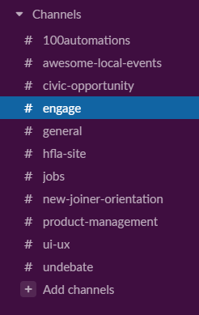
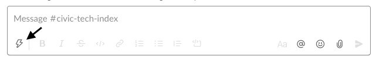
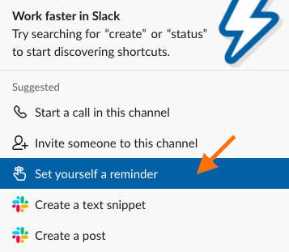
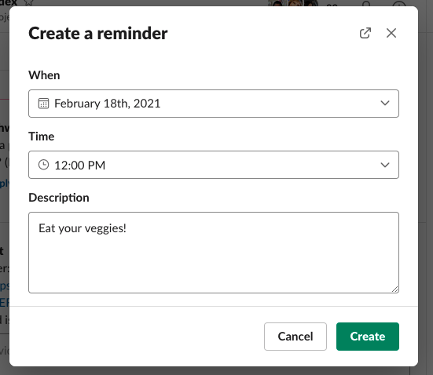
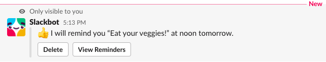
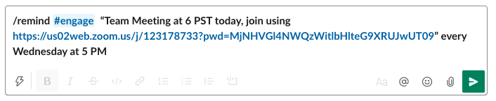
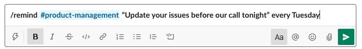
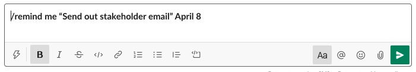
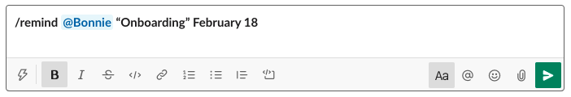

# **What** is Slack?

Slack is a communication and collaboration platform that organizes conversations into topics, groups or private messages.  Each topic or group is called a Channel.  Hack for LA uses slack to allow teams to connect, discuss and work on projects collectively.  There are channels set up for both specific projects, and specific functional roles. 


# **When** to use Reminders ⏰

Slack has a function that **allows you to set up an automatic reminder with a tailored message **sent out by the Bot at a specified time.  

**Who to setup reminders for**
* Yourself 
* Someone else 
* The Whole Channel

**Type of Reminders**

* Remind the team about upcoming team meetings
* Remind people to update issues by a certain date
* Remind yourself to check back in with someone at a certain time


# **How** to Set Reminders ☑️

**Reminders can be set up in two ways:**


## Using Navigation Shortcuts

&nbsp;&nbsp;&nbsp;&nbsp;&nbsp;&nbsp; Navigate to the channel you want to set up the reminder





&nbsp;&nbsp;&nbsp;&nbsp;&nbsp;&nbsp; Click the lightning bolt at the bottom of the message window 



    


&nbsp;&nbsp;&nbsp;&nbsp;&nbsp;&nbsp; Filter for and select the reminder option in the Suggested list, **OR…**





&nbsp;&nbsp;&nbsp;&nbsp;&nbsp;&nbsp; Type in “reminder”


&nbsp;&nbsp;&nbsp;&nbsp;&nbsp;&nbsp; Go ahead and set your reminder





&nbsp;&nbsp;&nbsp;&nbsp;&nbsp;&nbsp; Click on the “create” button and you’re good to go! 





## Direct Entry into the message box


&nbsp;&nbsp;&nbsp;&nbsp;&nbsp;&nbsp; In the message box, type /remind 


1. Type “/remind” in the text box (see above).
2. To Whom? @ or # 


```

        If to a specific person: @someone

```

```
        If the entire channel: #channel
```

3. In quotes write the reminder text you want the Bot to send out.
4. Last, input day and time you want the Bot to send out the message. **NOTE: the time zone listed will be your time zone.**


# **Examples**













---


Peer-created guides are an important part of Hack for LA’s Culture. Help us to make it better by posting any comments directly next to the content.

This guide was created and contributed to by: Maria Studnicka, Katie Jensen, Saasha Gilkes, Oliva Chiong, Alyssa Benipayo, Bukola Ogunleye and Bonnie Wolfe
