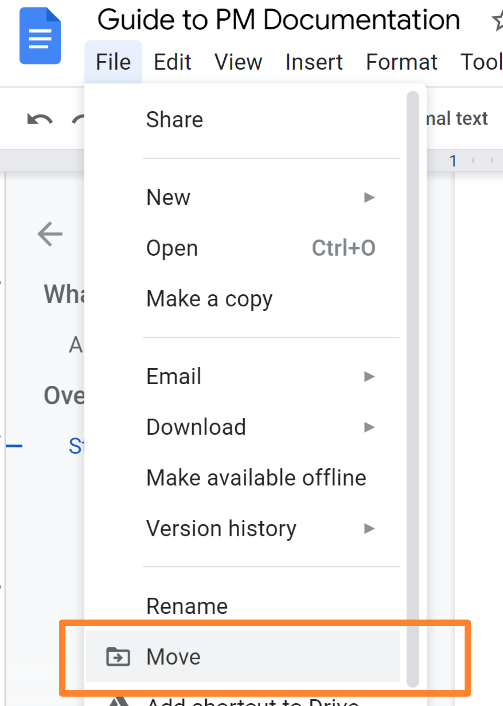
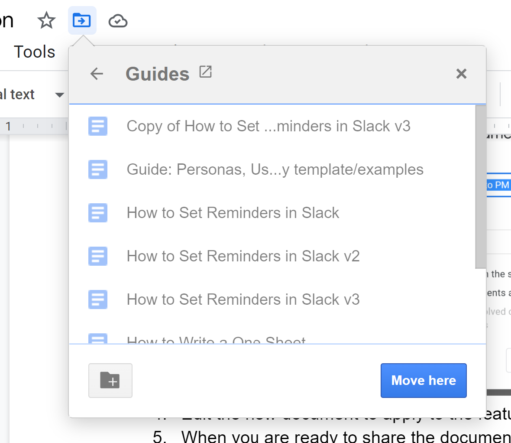
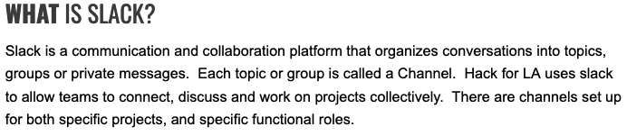

# **WHAT** IS THE GUIDE TEMPLATE

This guide documents how to write documentation about tools, Processes and  Practices (P&Ps) used or created at Hack for LA. Our guides are used to document and standardize Tools and P&Ps.  Use this guide to create your guide so that future users will have a clear reference and examples on how to replicate your success.

## Alternatives or things to know

For this guide, the audience is documenting processes and tools; if you are looking for a guide to documenting projects for external stakeholders, the Guide: [How to Write a One Sheet](https://docs.google.com/document/d/14-nYNCjrMrC8lucUNBfLOFQZk2sWbkRlJgigWDAlqlI/edit?usp=sharing) may be more useful.

# **HOW** TO WRITE A GUIDE

Write the guide to document how the user should achieve the desired goal.
1. Guides should be clear overviews of the process.
2. Write with a clear idea of the user’s problem and goal in mind. 
3. Aim to give users enough information to be able to move forward.
4. If there is detail that a user might need but is a fringe case, add an Additional Reference Material or Glossary section at the end to include the information. 
5. Make a separate guide for any sub practices or processes and link to it from the relevant location in your guide if the guide is too long and/or parts of the guide would be useful by themselves.

# **HOW** TO WRITE ABOUT PROCESSES

Process documentation should provide overviews of the process, detail how to implement the process and how to handle typical deviations. 

Example:

Overview of the process a new issue takes to be useful to the team (outdated, since its missing the New Issue Approval column)

# **HOW** TO PROVIDE STEP BY STEP INSTRUCTIONS

Document the steps to steps needed to accomplish a specific task.  The steps should be clear and brief, since the user’s goal will be to read them (often only once), do the task described, and continue with their work.

It may be helpful to approach this as a use case. Include visuals when possible, to make it easier for the user to understand the documentation.

# **INSTRUCTIONS** FOR USING THIS GUIDE’S TEMPLATES: Header & Guide

## CREATING AND STORING YOUR ASSETS

1. Create a place to store the documentation you will be creating
    1. Navigate to the guides folder for your community of practice
    2. Create a new folder for the guide, calling it the name specified in your GitHub issue (usually something such as Guide: How to ZYZ)
    3. Add a link to the folder to the issue you are working from
2. Make a header by using this [template](https://docs.google.com/drawings/d/1YJI1pKheA2uZfI8ICTtR8soJLuhqhoTUrzfv8YQerE4/copy) and save it into the folder you have created 
3. Use this [template](https://docs.google.com/document/d/1kV29V-mRPBNRRfIbYHrz05FElC02Dh6egaMANlxaZrM/copy) to start your guide
4. Name the guide the same as the folder you have created.

5. Move the  document into the folder you have created

        Choose  File > Move

A menu will pop up with options. Click on the “>” to the right of Shared with Me or Shared Drive

        Select the Community of Practice drive \

        Select the Guides folder

        Select the Folder you created before with the name of your guide

        [INSERT SCREENSHOT]

        And once inside it select Move here

        [INSERT SCREENSHOT]

## EDITING YOUR NEW GUIDE (WAS THIS SUPPOSED TO BE H3)

Use the Instructions and examples below to know how to fill out specific sections of the guide template

# **WHAT** IS THIS GUIDE OR PROCESS?

    In a paragraph or so, explain (1) what the feature or goal is, and (2) how the user would use it. The goal is to summarize why someone would read this guide, so they can understand whether it meets their needs. 

    Example:

    [insert example of an effectively written WHAT here]

## Alternatives or things to know?

    Is there anything that a reader should know up front? Are there other alternatives to the process you are describing, or any similar features? This section will not be necessary for all guides.

    Example:

    [insert example of an effectively written Alternative here]

# **WHAT** IS TOOL NAME?

    Describe what the tool is and how Hack for LA uses it.  Use this section if your guide uses tools, repeat if there are multiple tools.  This section will not be necessary for all guides.

Example: 

# **HOW** TO USE THE GUIDE OR PROCESS?
    Explain to a user, with illustrations if possible, what the feature or goal is and how to use it. This should be detailed information for users to reference as needed.

Example:
    [insert example of an effectively written HOW here]

## **PREREQUISITE ** FOR USING GUIDE
    List any prereqs for using the guide.  This section will not be necessary for all guides.

    Example:

    [insert example of an effectively written prereq here]

## **INSTRUCTIONS** FOR USING TEMPLATE: [Name of Template]
    If there is a template referenced from the guide please provide instructions for how to use it, so that the template does not contain the instructions directly.  We have found that this keeps instructions from accidentally ending up in the final Guide.

Example:
    [insert example of an effectively written TEMPLATE INSTRUCTIONS here]

# **FAQ**

## **TROUBLESHOOTING** When Trying to Execute the Steps

    In this section you should answer who, when and how to reach out for help if the following happens:

* When the guide might be missing steps do you want them to reach out to the guide creator via the issue #, If yes, please use this text:
    *  “From time to time a tool might change and this guide gets out of date.  Or you might be reviewing a work in progress guide.  If you find missing steps please post a comment on the [issue] for developing this guide.”  
* Make sure to link the word issue in the text to your guide making issue
* When an option is grayed out or missing (lack of permissions)

	Error messages & Warnings

# **FOOTER**

    After the sentence: “This guide was created and contributed to by”  Please add your name and the names of anyone contributing to the guide.

    Example: 

    See the footer at the bottom of this document as a typical example.

# **FORMATTING** TEXT INCLUDING SECTION HEADERS & STEPS

# **FORMATTING** IMAGES IN YOUR GUIDE

# **HOW** TO INCLUDE IMAGES IN YOUR GUIDE

Edit the How to Add Screenshots guide to include steps formatting

---

## Additional Reference Material:

### Style Guide
1. Use this document as a starting point to easily copy the style and formatting.
2. Main headings should be in all caps, with the first word in bold.
3. The page heading (blue title banner) for pages 2+ can be created by:
    1.  Following our guide for [How to Add Screenshots and Graphics to your Guide](https://docs.google.com/document/d/1OyPfKqUU7ZinhjMoRmsXywyZfME_Oo_hpC2Zdxlb310/edit#).
    2. Alternatively, it can be an embedded [image](https://docs.google.com/drawings/d/1t-nzL8Tw-1rC6dQ7QMq5CdVFUf5rspAHdSRsXgWXMtQ/edit) used for this guide, which can be copied and updated for future guides (follow the Image Troubleshooting directions below in order to avoid a pixelated image)
4. Use header settings for the structure of the guide, to make it accessible to screen readers. Do not just change the font size.
5. For image format and annotations guidance, also follow our guide for [How to Add Screenshots and Graphics to your Guide](https://docs.google.com/document/d/1OyPfKqUU7ZinhjMoRmsXywyZfME_Oo_hpC2Zdxlb310/edit#). Add a **1px** line weight black outline around your images, and whenever possible we recommend adding a rectangle around the point of interest:
    3. Use hex code **#FF832E** and **4px** line weight for the rectangle
6. Keep the guide as brief as possible while still communicating the necessary information. 
    4. Users may not read the full guide.
    5. Use bullet points where possible; studies show that readers are more comfortable with short lines than long paragraphs, even if the information is the same.
7. Include illustrations wherever possible.

### Illustration Troubleshooting

1. To embed the image, either use a photo editor or use Google Drawings.
2. If using Google Drawings, create each image as a Google Drawing.
    1. Paste the screenshot or image into the Google Drawing
    2. Crop the canvas to the size of the image
    3. Embed the image into the Guide by Inserting the Drawing. If the image is fuzzy, go to Page Options in the Drawing and increase the canvas size (suggested 10x), then update the embedded drawing.
3. [This (linked)](https://docs.google.com/drawings/d/1t-nzL8Tw-1rC6dQ7QMq5CdVFUf5rspAHdSRsXgWXMtQ/edit) is an example of Google Drawing image embedded in this guide.

---

Peer-created guides are an important part of Hack for LA’s Culture. Help us to make it better by posting any comments directly next to the content.

This guide was created and contributed to by: Rose Crowell, Erika Gil, Katie Jensen and Bonnie Wolfe
